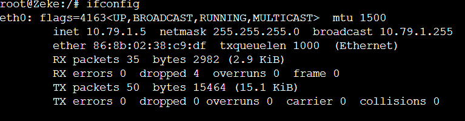
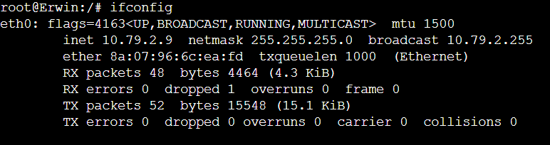
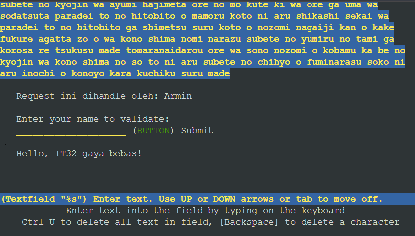

# Jarkom-Modul-3-IT32-2024

##### Praktikum Jaringan Komputer Modul 3 Tahun 2024

### Author
| Nama | NRP |
|---------|---------|
| Muhammad Kenas Galeno Putra | 5027231069   |
| Veri Rahman | 5027231088   |

# Laporan Resmi

# Daftar Isi
- [Konfigurasi](#topologi)
- [Nomor 0](#soal-0)
- [Nomor 1](#soal-1)
- [Nomor 2](#soal-2)
- [Nomor 3](#soal-2)
- [Nomor 4](#soal-2)
- [Nomor 5](#soal-2)
- [Nomor 6](#soal-6)


### Topologi
<a name="topologi"></a>


### Config

#### Paradis (Router (DHCP Relay)) ####
```bash
auto eth0
iface eth0 inet dhcp

auto eth1
iface eth1 inet static
	address 10.79.1.1
	netmask 255.255.255.0

auto eth2
iface eth2 inet static
	address 10.79.2.1
	netmask 255.255.255.0

auto eth3
iface eth3 inet static
	address 10.79.3.1
	netmask 255.255.255.0

auto eth4
iface eth4 inet static
	address 10.79.4.1
	netmask 255.255.255.0

up iptables -t nat -A POSTROUTING -o eth0 -j MASQUERADE -s 10.79.0.0/16
```
#### Tybur (DHCP Server) ####
```bash
auto eth0
iface eth0 inet static
 			address 10.79.4.3
  			netmask 255.255.255.0
  			gateway 10.79.4.1
up echo nameserver 192.168.122.1 > /etc/resolv.conf
```
#### Fritz (DNS Server) ####
```bash
auto eth0
iface eth0 inet static
 			address 10.79.4.2
  			netmask 255.255.255.0
  			gateway 10.79.4.1
up echo nameserver 192.168.122.1 > /etc/resolv.conf
```
#### Warhammer (Database Server) ####
```bash
auto eth0
iface eth0 inet static
 			address 10.79.3.4
  			netmask 255.255.255.0
  			gateway 10.79.3.1
up echo nameserver 192.168.122.1 > /etc/resolv.conf
```
#### Beast (Load Balancer (Laravel)) ####
```bash
auto eth0
iface eth0 inet static
 			address 10.79.3.2
  			netmask 255.255.255.0
  			gateway 10.79.3.1
up echo nameserver 192.168.122.1 > /etc/resolv.conf
```
#### Colossal (Load Balancer (PHP)) ####
```bash
auto eth0
iface eth0 inet static
 			address 10.79.3.3
  			netmask 255.255.255.0
  			gateway 10.79.3.1
up echo nameserver 192.168.122.1 > /etc/resolv.conf
```
#### Annie (Laravel Worker) ####
```bash
auto eth0
iface eth0 inet static
 			address 10.79.1.2
  			netmask 255.255.255.0
  			gateway 10.79.1.1
up echo nameserver 192.168.122.1 > /etc/resolv.conf
```
#### Bertholdt (Laravel Worker) ####
```bash
auto eth0
iface eth0 inet static
 			address 10.79.1.3
  			netmask 255.255.255.0
  			gateway 10.79.1.1
up echo nameserver 192.168.122.1 > /etc/resolv.conf
```
#### Reiner (Laravel Worker) ####
```bash
auto eth0
iface eth0 inet static
 			address 10.79.1.4
  			netmask 255.255.255.0
  			gateway 10.79.1.1
up echo nameserver 192.168.122.1 > /etc/resolv.conf
```
#### Armin (PHP Worker) ####
```bash
auto eth0
iface eth0 inet static
 			address 10.79.2.2
  			netmask 255.255.255.0
  			gateway 10.79.2.1
up echo nameserver 192.168.122.1 > /etc/resolv.conf
```
#### Eren (PHP Worker) ####
```bash
auto eth0
iface eth0 inet static
 			address 10.79.2.3
  			netmask 255.255.255.0
  			gateway 10.79.2.1
up echo nameserver 192.168.122.1 > /etc/resolv.conf
```
#### Mikasa (PHP Worker) ####
```bash
auto eth0
iface eth0 inet static
 			address 10.79.2.4
  			netmask 255.255.255.0
  			gateway 10.79.2.1
up echo nameserver 192.168.122.1 > /etc/resolv.conf
```
#### Zeke (Client) ####
```bash
auto eth0
iface eth0 inet dhcp

up echo nameserver 10.79.4.2 > /etc/resolv.conf // IP DNS Server
up echo nameserver 192.168.122.1 >> /etc/resolv.conf
```
#### Erwin (Client) ####
```bash
auto eth0
iface eth0 inet dhcp

up echo nameserver 10.79.4.2 > /etc/resolv.conf // IP DNS Server
up echo nameserver 192.168.122.1 >> /etc/resolv.conf
```
### Setup Node
#### Paradis (Router)
```bash
apt-get update
apt install isc-dhcp-relay -y
```
#### Tybur (DHCP Server)
```bash
apt-get update
apt-get install isc-dhcp-server -y
```
#### Fritz (DNS Server)
```bash
apt-get update
apt-get install bind9 -y
```

### Soal 0
<a name="soal-0"></a>
Pulau Paradis telah menjadi tempat yang damai selama 1000 tahun, namun kedamaian tersebut tidak bertahan selamanya. Perang antara kaum Marley dan Eldia telah mencapai puncak. Kaum Marley yang dipimpin oleh Zeke, me-register domain name marley.yyy.com untuk worker Laravel mengarah pada Annie. Namun ternyata tidak hanya kaum Marley saja yang berinisiasi, kaum Eldia ternyata sudah mendaftarkan domain name eldia.yyy.com untuk worker PHP (0) mengarah pada Armin.
#### Script ####
```bash
echo "zone \"marley.IT32.com\" {
	type master;
	file \"/etc/bind/jarkom/marley.IT32.com\";
};

zone \"eldia.IT32.com\" {
	type master;
	file \"/etc/bind/jarkom/eldia.IT32.com\";
};
" > /etc/bind/named.conf.local

mkdir /etc/bind/jarkom

marley="
;
;BIND data file for local loopback interface
;
\$TTL    604800
@    IN    SOA    marley.IT32.com. root.marley.IT32.com. (
        2        ; Serial
                604800        ; Refresh
                86400        ; Retry
                2419200        ; Expire
                604800 )    ; Negative Cache TTL
;                   
@    IN    NS    marley.IT32.com.
@       IN    A    10.79.1.2
"
echo "$marley" > /etc/bind/jarkom/marley.IT32.com

eldia="
;
;BIND data file for local loopback interface
;
\$TTL    604800
@    IN    SOA    eldia.IT32.com. root.eldia.IT32.com. (
        2        ; Serial
                604800        ; Refresh
                86400        ; Retry
                2419200        ; Expire
                604800 )    ; Negative Cache TTL
;                   
@    IN    NS    eldia.IT32.com.
@       IN    A    10.79.2.1
"
echo "$eldia" > /etc/bind/jarkom/eldia.IT32.com

service bind9 restart
```

### Soal 1
<a name="soal-1"></a>
Lakukan konfigurasi sesuai dengan peta yang sudah diberikan.
#### Output ####
Sesuai Config diatas

### Soal 2-5
<a name="soal-2"></a>
Jauh sebelum perang dimulai, ternyata para keluarga bangsawan, Tybur dan Fritz, telah membuat kesepakatan sebagai berikut:

- Semua Client harus menggunakan konfigurasi ip address dari keluarga Tybur (dhcp).

- Client yang melalui bangsa marley mendapatkan range IP dari [prefix IP].1.05 - [prefix IP].1.25 dan [prefix IP].1.50 - [prefix IP].1.100 (2)

- Client yang melalui bangsa eldia mendapatkan range IP dari [prefix IP].2.09 - [prefix IP].2.27 dan [prefix IP].2 .81 - [prefix IP].2.243 (3)

- Client mendapatkan DNS dari keluarga Fritz dan dapat terhubung dengan internet melalui DNS tersebut (4)

- Dikarenakan keluarga Tybur tidak menyukai kaum eldia, maka mereka hanya meminjamkan ip address ke kaum eldia selama 6 menit. Namun untuk kaum marley, keluarga Tybur meminjamkan ip address selama 30 menit. Waktu maksimal dialokasikan untuk peminjaman alamat IP selama 87 menit. (5)

	- *pada Paradis (DHCP Relay) kita dapat membuat script bernama paradis.sh yang mengarah ke Tybur (DHCP Server)*
### DHCP Relay (Paradis)
```bash
service isc-dhcp-relay start 

echo '
SERVERS="10.79.4.3"
INTERFACES="eth1 eth2 eth3 eth4"
OPTIONS=""' > /etc/default/isc-dhcp-relay

echo net.ipv4.ip_forward=1 > /etc/sysctl.conf

service isc-dhcp-relay restart 
```
- *Note: Karena kebanyakan kode diletakan di file yang sama, maka soal digabung agar lebih efisien*

### DHCP Server (Tybur)
```bash
echo 'nameserver 10.79.4.2' >> /etc/resolv.conf   # Pastikan DNS Server sudah berjalan 

echo 'INTERFACESv4="eth0"' > /etc/default/isc-dhcp-server

echo 'subnet 10.79.1.0 netmask 255.255.255.0 {

    # Soal ke-2
    range 10.79.1.05 10.79.1.25;
    range 10.79.1.50 10.79.1.100;
    option routers 10.79.1.1;

    # Soal ke-4
    option broadcast-address 10.79.1.255;
    option domain-name-servers 10.79.4.2;
    
    # Soal ke-5
    default-lease-time 1800;
    max-lease-time 5220;
}

subnet 10.79.2.0 netmask 255.255.255.0 {

    # Soal ke-3
    range 10.79.2.09 10.79.2.27;
    range 10.79.2.81 10.79.2.243;
    option routers 10.79.2.1;

    # Soal ke-4
    option broadcast-address 10.79.2.255;
    option domain-name-servers 10.79.4.2;

    # Soal ke-5
    default-lease-time 360;
    max-lease-time 5220;
}

subnet 10.79.3.0 netmask 255.255.255.0 {

}

subnet 10.79.4.0 netmask 255.255.255.0 {

}' > /etc/dhcp/dhcpd.conf

service isc-dhcp-server restart
```
- *Note: Pada soal ke-4 lakukan juga setup option pada Fritz (DNS Server)
```bash
echo 'options {
        directory "/var/cache/bind";

        forwarders {
                192.168.122.1;
         };

        dnssec-validation no;
        allow-query{any;};
        auth-nxdomain no;
        listen-on-v6 { any; };
}; ' >/etc/bind/named.conf.options
```
#### Output No 2 ####


#### Output No 3 ####


#### Output No 4 ####


### Soal no 6
<a name="soal-6"></a>
Armin berinisiasi untuk memerintahkan setiap worker PHP untuk melakukan konfigurasi virtual host untuk website berikut https://intip.in/BangsaEldia dengan menggunakan php 7.3 (6)

- Untuk itu jalankan script berikut di semua php worker yaitu; Armin, Eren dan Mikasa
```bash
echo 'nameserver 10.79.4.2' > /etc/resolv.conf
apt-get update
apt-get install nginx -y
apt-get install wget -y
apt-get install unzip -y
apt-get install lynx -y
apt-get install htop -y
apt-get install apache2-utils -y
apt-get install php7.3-fpm php7.3-common php7.3-mysql php7.3-gmp php7.3-curl php7.3-intl php7.3-mbstring php7.3-xmlrpc php7.3-gd php7.3-xml php7.3-cli php7.3-zip -y

service nginx start
service php7.3-fpm start

mkdir -p /var/www/eldia.it32.com

wget --no-check-certificate 'https://drive.google.com/uc?export=download&id=1TvebIeMQjRjFURKVtA32lO9aL7U2msd6' -O /root/bangsaEldia.zip
unzip /root/bangsaEldia.zip -d /var/www/eldia.it32.com
rm -rf /root/bangsaEldia.zip

echo '
server {

        listen 80;

        root /var/www/eldia.it32.com;

        index index.php index.html index.htm;
        server_name _;

        location / {
                        try_files $uri $uri/ /index.php?$query_string;
        }

        # pass PHP scripts to FastCGI server
        location ~ \.php$ {
        include snippets/fastcgi-php.conf;
        fastcgi_pass unix:/var/run/php/php7.3-fpm.sock;
        }

location ~ /\.ht {
                        deny all;
        }

        error_log /var/log/nginx/jarkom_error.log;
        access_log /var/log/nginx/jarkom_access.log;
 }' > /etc/nginx/sites-available/eldia.it32.com

ln -s /etc/nginx/sites-available/eldia.it32.com /etc/nginx/sites-enabled
rm -rf /etc/nginx/sites-enabled/default

service php7.3-fpm start
service php7.3-fpm restart
service nginx restart
nginx -t
```
#### Output ####

