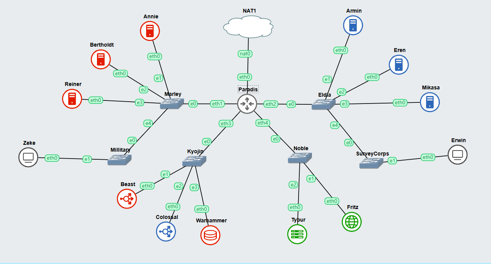

# Jarkom-Modul-3-IT32-2024

##### Praktikum Jaringan Komputer Modul 3 Tahun 2024

### Author
| Nama | NRP |
|---------|---------|
| Muhammad Kenas Galeno Putra | 5027231069   |
| Veri Rahman | 5027231088   |

# Laporan Resmi

# Daftar Isi
- [Konfigurasi](#topologi)
- [Nomor 0](#soal-0)
- [Nomor 1](#soal-1)


### Topologi
<a name="topologi"></a>


### Config

# Paradis (Router (DHCP Relay))
```bash
auto eth0
iface eth0 inet dhcp

auto eth1
iface eth1 inet static
	address 10.79.1.1
	netmask 255.255.255.0

auto eth2
iface eth2 inet static
	address 10.79.2.1
	netmask 255.255.255.0

auto eth3
iface eth3 inet static
	address 10.79.3.1
	netmask 255.255.255.0

auto eth4
iface eth4 inet static
	address 10.79.4.1
	netmask 255.255.255.0

up iptables -t nat -A POSTROUTING -o eth0 -j MASQUERADE -s 10.79.0.0/16
```
# Tybur (DHCP Server)
```bash
auto eth0
iface eth0 inet static
 			address 10.79.4.3
  			netmask 255.255.255.0
  			gateway 10.79.4.1
up echo nameserver 192.168.122.1 > /etc/resolv.conf
```
# Fritz (DNS Server)
```bash
auto eth0
iface eth0 inet static
 			address 10.79.4.2
  			netmask 255.255.255.0
  			gateway 10.79.4.1
up echo nameserver 192.168.122.1 > /etc/resolv.conf
```
# Warhammer (Database Server)
```bash
auto eth0
iface eth0 inet static
 			address 10.79.3.4
  			netmask 255.255.255.0
  			gateway 10.79.3.1
up echo nameserver 192.168.122.1 > /etc/resolv.conf
```
# Beast (Load Balancer (Laravel))
```bash
auto eth0
iface eth0 inet static
 			address 10.79.3.3
  			netmask 255.255.255.0
  			gateway 10.79.3.1
up echo nameserver 192.168.122.1 > /etc/resolv.conf
```
# Colossal (Load Balancer (PHP))
```bash
auto eth0
iface eth0 inet static
 			address 10.79.3.2
  			netmask 255.255.255.0
  			gateway 10.79.3.1
up echo nameserver 192.168.122.1 > /etc/resolv.conf
```
# Annie (Laravel Worker)
```bash
auto eth0
iface eth0 inet static
 			address 10.79.1.2
  			netmask 255.255.255.0
  			gateway 10.79.1.1
up echo nameserver 192.168.122.1 > /etc/resolv.conf
```
# Bertholdt (Laravel Worker)
```bash
auto eth0
iface eth0 inet static
 			address 10.79.1.3
  			netmask 255.255.255.0
  			gateway 10.79.1.1
up echo nameserver 192.168.122.1 > /etc/resolv.conf
```
# Reiner (Laravel Worker)
```bash
auto eth0
iface eth0 inet static
 			address 10.79.1.4
  			netmask 255.255.255.0
  			gateway 10.79.1.1
up echo nameserver 192.168.122.1 > /etc/resolv.conf
```
# Armin (PHP Worker)
```bash
auto eth0
iface eth0 inet static
 			address 10.79.2.2
  			netmask 255.255.255.0
  			gateway 10.79.2.1
up echo nameserver 192.168.122.1 > /etc/resolv.conf
```
# Eren (PHP Worker)
```bash
auto eth0
iface eth0 inet static
 			address 10.79.2.3
  			netmask 255.255.255.0
  			gateway 10.79.2.1
up echo nameserver 192.168.122.1 > /etc/resolv.conf
```
# Mikasa (PHP Worker)
```bash
auto eth0
iface eth0 inet static
 			address 10.79.2.4
  			netmask 255.255.255.0
  			gateway 10.79.2.1
up echo nameserver 192.168.122.1 > /etc/resolv.conf
```
# Zeke (Client)
```bash
auto eth0
iface eth0 inet static
  address 10.79.1.5
  netmask 255.255.255.0
  gateway 10.79.1.1

up echo nameserver 10.79.4.2 > /etc/resolv.conf // IP DNS Server
up echo nameserver 192.168.122.1 >> /etc/resolv.conf
```
# Erwin (Client)
```bash
auto eth0
iface eth0 inet static
  address 10.79.2.5
  netmask 255.255.255.0
  gateway 10.79.2.1

up echo nameserver 10.79.4.2 > /etc/resolv.conf // IP DNS Server
up echo nameserver 192.168.122.1 >> /etc/resolv.conf
```
